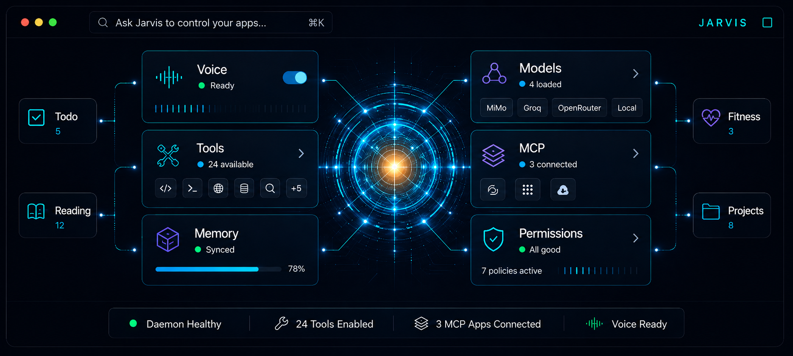

<p align="center">
  
</p>

<br />

<p align="center">
  
</p>

<h1 align="center">CoreLayer — powered by Jarvis</h1>

<p align="center">
  <strong>桌面端个人应用 AI 控制层。</strong>
</p>

<p align="center">
  Jarvis 是内建的 AI 助手人格，帮助你控制任务、工具、模型、MCP 应用和语音工作流。
</p>

<p align="center">
  语音原生 · MCP 优先 · 工具感知 · 权限守护 · 本地优先
</p>

<p align="center">
  
  
  
  
  
</p>

<p align="center">
  <a href="./README.md">English</a> · <a href="./README_zh.md">简体中文</a>
</p>

---

## 什么是 CoreLayer？

**CoreLayer** 是一个面向个人应用的桌面端 AI 命令控制层。

它不是又一个 AI 聊天窗口。
它是一个本地优先的桌面控制中心，将你的任务、工具、模型、MCP 应用、语音工作流和个人数据连接到一个 AI 可操作的统一界面中。

内建的 AI 助手人格叫做 **Jarvis**。

Jarvis 可以帮你：

- 查看今天的任务和优先级
- 管理阅读清单并追踪进度
- 记录每日复盘并自动生成摘要
- 通过 MCP 控制已连接的个人应用
- 通过权限策略安全地调用工具
- 跨不同 AI 模型路由请求
- 通过语音交互并流式播报
- 连接外部 MCP 服务器

---

## 为什么需要 CoreLayer？

大多数 AI 助手要么是：

- 没有工具感知的通用聊天机器人
- 锁定在单一生态的应用内副驾驶
- 拥有你数据的云端自动化工具
- 没有安全模型的插件堆砌仪表盘

CoreLayer 不一样。

它围绕一个简洁的理念设计：

> 你的个人应用应该保持独立，但 Jarvis 应该能够安全地理解、调用和协调它们。

CoreLayer 是你、你的工具、你的模型和个人应用生态之间的控制层。

---

## 核心能力

<table>
  <tr>
    <td width="50%">
      
      <h3>MCP 优先集成</h3>
      <p>通过 MCP 服务器连接个人应用和外部工具。</p>
    </td>
    <td width="50%">
      
      <h3>统一工具调用</h3>
      <p>注册、路由、执行和展示来自原生模块、MCP、技能和 REST 适配器的工具。</p>
    </td>
  </tr>
  <tr>
    <td width="50%">
      
      <h3>权限守卫</h3>
      <p>分类风险操作，暂停确认，并为每次工具调用保留审计日志。</p>
    </td>
    <td width="50%">
      
      <h3>模型路由</h3>
      <p>根据任务需求跨 MiMo、Groq、OpenRouter 和本地模型路由请求。</p>
    </td>
  </tr>
  <tr>
    <td width="50%">
      
      <h3>语音管线</h3>
      <p>唤醒、监听、转录、流式响应、语音播报，支持打断续听。</p>
    </td>
    <td width="50%">
      
      <h3>控制中心</h3>
      <p>管理模型、应用、工具、权限、语音配置、守护进程健康和日志。</p>
    </td>
  </tr>
</table>

---

## 架构

```text
用户
 │
语音 / 文本 / 快捷键
 │
CoreLayer 桌面应用 (Tauri 2.0)
 │
├── Tauri Shell
│   ├── 浮动 Jarvis 窗口
│   ├── 命令面板
│   └── 控制中心 UI
│
├── JarvisClient (前端)
│   ├── 带重试的 HTTP 客户端
│   ├── SSE 流式解析器
│   ├── ASR / TTS 客户端
│   └── Zustand 状态管理
│
├── Node.js 守护进程 (Hono)
│   ├── AI 编排器
│   ├── 模型网关
│   ├── 工具注册中心
│   ├── 权限守卫
│   ├── MCP 客户端管理器
│   └── 审计日志
│
├── 工具来源
│   ├── 原生工具 (任务、阅读、复盘)
│   ├── MCP 工具
│   ├── 技能
│   └── REST 适配器
│
└── 数据层
    ├── SQLite (本地优先)
    ├── Supabase (云同步)
    └── PostgreSQL (通用)
```

---

## 认识 Coreling

<p align="center">
  
</p>

**Coreling** 是 Jarvis 的全息 AI 核心伙伴。

它代表了 CoreLayer 背后语音原生、MCP 优先、权限感知的命令控制层。

Coreling 不是产品 Logo。
产品身份是 **CoreLayer 控制系统**。
Coreling 是用于引导、语音模式、加载状态和文档中的助手头像。

---

## 功能概览

| 领域                | 说明                                                       |
| ------------------- | ---------------------------------------------------------- |
| **桌面控制中心**    | Tauri 驱动的桌面应用，暗色产品仪表盘 UI。                  |
| **Jarvis 助手人格** | 内建助手身份，支持语音和文本交互。                         |
| **MCP 集成**        | 连接外部 MCP 服务器，将工具注册到统一注册中心。            |
| **工具注册中心**    | 统一工具层，支持原生、MCP、技能和 REST 工具。              |
| **权限守卫**        | 基于风险的执行控制，支持异步确认和审计日志。               |
| **模型网关**        | 跨 MiMo、Groq、OpenRouter、Ollama 和本地模型路由请求。     |
| **语音管线**        | 唤醒词、ASR、流式 LLM 响应、TTS 和打断。                   |
| **智能任务**        | 任务管理器，支持优先级、到期日、标签和自然语言创建。       |
| **阅读追踪**        | 书籍/文章跟踪，状态管理和阅读统计。                        |
| **每日复盘**        | 自动每日/每周摘要，完成度指标。                            |
| **三合一存储**      | 本地 SQLite、Supabase 云同步或通用 PostgreSQL — 可热切换。 |
| **审计日志**        | 追踪工具调用、权限、耗时、风险等级和结果。                 |

---

## 技术栈

| 层级     | 技术                                        |
| -------- | ------------------------------------------- |
| 桌面端   | Tauri 2                                     |
| 前端     | React 19、Vite、Tailwind CSS、shadcn/ui     |
| 状态管理 | Zustand                                     |
| 守护进程 | Node.js、Hono                               |
| 数据库   | SQLite、Drizzle ORM                         |
| AI SDK   | Vercel AI SDK                               |
| 模型     | MiMo、Groq、OpenRouter、Ollama、OpenAI 兼容 |
| 语音     | Web Speech API、Groq Whisper、MiMo TTS      |
| 协议     | MCP (Model Context Protocol)                |
| 包管理器 | pnpm workspaces                             |

---

## 项目结构

```text
corelayer/
├── frontend/                    # Tauri 2.0 桌面客户端
│   ├── src/
│   │   ├── components/          # React UI 组件
│   │   ├── hooks/               # 自定义 Hooks
│   │   ├── stores/              # Zustand 状态管理
│   │   ├── lib/                 # 客户端工具库
│   │   │   ├── jarvisClient.ts  # 带重试的 HTTP 客户端
│   │   │   ├── sseParser.ts     # SSE 流式解析器
│   │   │   └── voiceProfile.ts  # 语音配置管理器
│   │   └── App.tsx
│   └── src-tauri/               # Rust 原生代码
│       └── src/
│           ├── lib.rs           # Tauri 命令
│           └── daemon_supervisor.rs
│
├── daemon/                      # Node.js 后端
│   └── src/
│       ├── api/                 # Hono REST 端点
│       ├── orchestrator/        # AI 编排器与 Prompt 构建
│       ├── tools/               # 原生工具
│       │   ├── todo/            # 任务管理
│       │   ├── reading/         # 阅读清单
│       │   └── review/          # 每日/每周复盘
│       ├── voice/               # ASR 与 TTS
│       ├── config/              # 环境与存储配置
│       └── db/
│           ├── sqlite/          # SQLite 仓储
│           └── supabase/        # 云仓储
│
├── packages/                    # 共享包
│   ├── types/                   # 共享 TypeScript 类型
│   ├── model-gateway/           # 多提供商模型路由
│   ├── mcp-client/              # MCP 服务器连接
│   ├── tool-registry/           # 统一工具注册
│   └── permission-guard/        # 风险执行守卫
│
├── public/
│   └── assets/                  # 视觉资源
│       ├── corelayer-hero.png   # README 横幅
│       ├── coreling.png         # 助手头像
│       ├── icon.png             # 桌面应用图标
│       └── icons/               # 功能模块 SVG 图标
│
└── docs/                        # 文档
```

---

## 快速开始

### 前置要求

- Node.js 20+
- pnpm 9+
- Rust（最新稳定版，用于 Tauri）
- Tauri 平台依赖

### 安装

```bash
git clone https://github.com/your-username/Jarvis.git
cd Jarvis
pnpm install
```

### 环境配置

在项目根目录创建 `.env`：

```env
AI_PROVIDER=mimo

MIMO_API_KEY=your_mimo_key
MIMO_MODEL=mimo-v2.5

GROQ_API_KEY=your_groq_key
OPENROUTER_API_KEY=your_openrouter_key

SQLITE_DB_PATH=./daemon/data/corelayer.db
DAEMON_PORT=3001
```

### 启动守护进程

```bash
pnpm --filter daemon dev
```

### 启动桌面应用

```bash
pnpm --filter frontend tauri dev
```

同时拉起 Hono 守护进程与 Tauri 桌面窗口。

---

## 安装与运行常见问题 (FAQ)

### 1. macOS 提示“App 已损坏，您应该将它移到废纸篓”

- **原因**：由于项目目前未缴纳 Apple 开发者年费进行代码签名与公证（Notarization），macOS Gatekeeper 安全机制在下载后会强制将 App 隔离并提示损坏。
- **解决办法**：
  1. 将安装挂载出的 `Jarvis.app` 拖入到 **应用程序 (Applications)** 文件夹中。
  2. 打开系统的 **终端 (Terminal)**，运行以下命令（会提示输入 Mac 的开机密码）：
     ```bash
     sudo xattr -r -d com.apple.quarantine /Applications/Jarvis.app
     ```
  3. 执行完毕后重新双击 App 即可正常启动。

### 2. Windows 覆盖安装/更新时提示文件被锁定（锁死错误）

- **原因**：可能因为后台旧版本的 `jarvis-daemon.exe` 守护进程仍在运行，占用了 SQLite 的原生扩展库（`better_sqlite3.node`）。
- **解决办法**：安装包内建了自动杀进程的安装钩子。如果仍旧遇到锁定弹窗，请在 Windows 任务管理器中手动结束所有 `jarvis-daemon.exe` 进程，或者打开命令行运行以下指令后，再重试安装：
  ```cmd
  taskkill /f /im jarvis-daemon.exe
  ```

---

## 示例指令

向 Jarvis 提问：

```text
今天应该专注什么？
```

```text
按优先级显示我的任务。
```

```text
把这篇文章加入阅读清单。
```

```text
总结我这周的进展。
```

```text
连接我的 GitHub MCP 服务器。
```

```text
用快速模型处理这条语音指令。
```

```text
当前启用了哪些工具？
```

---

## 控制中心

CoreLayer 包含桌面控制中心，用于管理：

- 守护进程状态和健康检查
- 已连接应用和 MCP 服务器
- 模型配置和路由规则
- 工具注册中心和发现
- 权限策略和审计日志
- 语音配置和测试控制台
- 本地记忆和上下文

---

## 工具安全

CoreLayer 按风险等级分类工具。

| 风险     | 行为       | 示例         |
| -------- | ---------- | ------------ |
| **低**   | 自动执行   | 查看当前任务 |
| **中**   | 执行并通知 | 创建新任务   |
| **高**   | 需要确认   | 删除项目     |
| **极高** | 需显式批准 | 系统级命令   |

所有工具调用都会写入审计日志，包含耗时、风险等级和结果状态。

---

## MCP 集成

CoreLayer 连接 MCP 服务器，将工具注册到统一的工具注册中心。

支持的连接类型：

```text
stdio · HTTP · SSE
```

MCP 工具被标准化为 CoreLayer 内部格式：

```text
mcp:{serverId}:{toolName}
```

这允许 Jarvis 通过与原生工具相同的权限、日志和展示管线调用外部工具。

---

## 模型路由

不同任务需要不同模型。CoreLayer 跨提供商路由请求：

```text
快速语音指令       → 低延迟模型 (MiMo, Groq)
工具密集型工作流   → 工具代理模型
本地隐私请求       → 本地模型 (Ollama)
长推理任务         → 推理模型 (OpenRouter)
```

可通过控制中心 UI 添加提供商，支持预设目录或自定义 OpenAI 兼容端点。

---

## 存储模式

CoreLayer 支持三种存储模式，运行时可热切换：

| 模式            | 说明                                 |
| --------------- | ------------------------------------ |
| **本地 SQLite** | 零配置，离线优先，数据留在本地。     |
| **Supabase**    | 一键多设备云同步。                   |
| **PostgreSQL**  | 兼容 AWS RDS、Neon、Aiven 或自托管。 |

实时切换数据库无需重启应用。

---

## 语音管线

Jarvis 支持语音原生交互流程：

```text
唤醒词检测
  ↓
ASR 语音识别
  ↓
流式模型响应
  ↓
句级 TTS 队列播报
  ↓
打断续听
  ↓
上下文追问
```

语音配置支持不同语言、模型和声音设置。

---

## 路线图

### 第一阶段 — 核心桌面层

- [x] Tauri 桌面 Shell
- [x] Hono 本地守护进程
- [x] 统一 JarvisClient
- [x] 流式聊天与工具调用
- [x] 工具注册中心
- [x] 权限守卫
- [x] 工具调用审计日志
- [x] 模型路由网关
- [x] 语音配置管理器
- [x] 智能任务、阅读、复盘工具

### 第二阶段 — 控制中心

- [x] 设置升级为完整控制中心
- [x] 模型配置管理 UI
- [x] MCP 连接管理器 UI
- [x] 工具注册中心浏览器
- [x] 权限矩阵 UI
- [x] 语音测试控制台
- [x] 守护进程健康仪表盘

### 第三阶段 — 个人应用生态

- [x] Veridia MCP 集成（REST 适配器）
- [x] TaskFlow 集成（原生仓库适配器）
- [x] FlexiLog 集成（REST 适配器）

### 第四阶段 — 技能与自动化

- [x] 本地技能运行时
- [x] 工作流技能
- [x] 定时复盘
- [x] 插件市场实验

---

## 设计系统

CoreLayer 使用暗色、沉静、未来感的视觉语言：

- 深海军蓝 / 近黑色背景
- 青色 AI 核心光晕
- 紫色模型路由强调色
- 琥珀色权限 / 反应器高亮
- HUD 风格环形和连线节点
- 专业产品仪表盘布局

视觉资源：

```text
public/assets/corelayer-hero.png    README 横幅
public/assets/coreling.png          助手头像
public/assets/icon.png              桌面应用图标
public/assets/icons/                功能模块 SVG 图标
```

---

## 命名

仓库和产品系统叫做 **CoreLayer**。

内建的 AI 助手人格叫做 **Jarvis**。

```text
CoreLayer = 桌面端 AI 控制层
Jarvis    = CoreLayer 内的助手人格
Coreling  = 全息 AI 核心伙伴
```

---

## 开源协议

[MIT](LICENSE)

---

## 状态

CoreLayer 目前处于实验阶段，优先面向个人使用。

长期目标是成为面向个人应用的 MCP 优先、本地优先桌面 AI 控制层。
