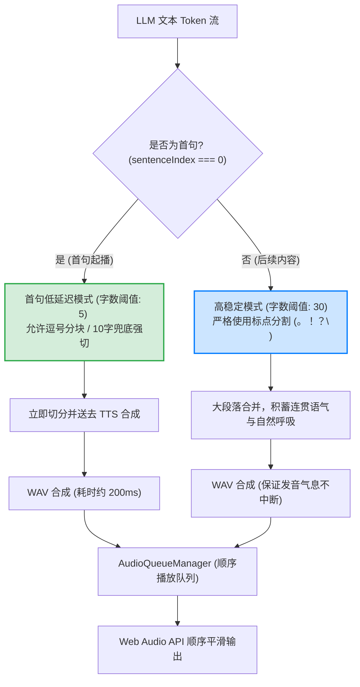

# 语音管线优化指南：音色一致性、超低延迟与UI渲染去噪设计

**日期:** 2026-05-29  
**严重程度:** High（影响语音交互质量与界面流畅度）  
**优化范围:** 语音分块算法、TTS API 参数整合、UI流式渲染解耦  
**状态:** 已优化并验证成功  

---

## 概述

在构建基于 LLM 文本流（Text Stream）与 TTS 语音流（Audio Stream）的语音助手时，通常会遇到以下两大核心痛点：
1. **音色漂移与接力朗读（Timbre Drift & Relay Reading）**：因为分块太碎且未锁定发音人 ID，导致合成音频时每句话的声线、语气、语速、呼吸均重新随机采样，听起来像不同的人在接力朗读。
2. **Markdown 渲染延迟**：将语音播放状态（Speaking）与大模型文本流式生成状态（Streaming）混淆，导致文本生成结束后，Markdown/表格布局必须等待整段语音完全播放完毕（数秒甚至数十秒后）才展示正常，极大破坏了视觉交互体验。

本项目通过**“后端锁定发音人 ID”**、**“动态首句低延迟双阈值分块算法”**及**“UI 文本与语音状态解耦”**，实现了首句毫秒级开播、长文本自然连贯呼吸感、以及完美的 Markdown 渲染体验。

---

## 架构设计图

以下是优化后的 **级联语音管线与分块流转架构**：



---

## 核心优化模块解析

### 1. 音色 ID 锁定与 API 参数整合

> [!IMPORTANT]
> **“写字类比”：** 
> * 锁定 Voice ID 决定了**“谁在写字”**（笔迹、字体风格一致）。
> * 维持合理的分块字数决定了**“写字时手是否频繁提起”**（字里行间的连笔、轻重缓急、运笔的气流与流畅度）。

#### 根因分析
原后端服务在调用小米 MiMo `/v1/chat/completions` API 时，漏传了包含 `voice` 和 `speed` 的 `audio` 配置对象。这使得云端 TTS 服务器在处理每个短片段时，因为没有明确的音色指纹锁定，都会发生随机声线重采样（Timbre Re-sampling）。

#### 解决方案
我们在后端 [tts.ts](file:///E:/code/github_project/Jarvis/daemon/src/voice/tts.ts) 中对请求负载进行了标准化封装，添加了标准的 OpenAI 格式 audio 完成参数：

```typescript
// daemon/src/voice/tts.ts
const audioConfig: Record<string, string> = {
  format: "wav",
};
if (selectedVoice) {
  audioConfig.voice = selectedVoice; // 锁定发音人，如 "茉莉"
}

const response = await fetch(url, {
  method: "POST",
  headers: {
    "Content-Type": "application/json",
    Authorization: `Bearer ${env.MIMO_API_KEY}`,
  },
  body: JSON.stringify({
    model,
    modalities: ["text", "audio"],
    audio: audioConfig,
    messages: [
      { role: "user", content: instruction }, // instruction 中动态融入 speed 参数，如 "语速稍微快一点"
      { role: "assistant", content: text },
    ],
  }),
});
```

同时，我们把默认音色在前后端统一为了最高质量的内置中文女声 `"茉莉"`，彻底解决了声线男女突变和粗细突变的问题。

---

### 2. 动态双阈值分块算法 (Dynamic Hybrid Splitting)

#### 根因分析
* **太短的分块**：如果每满 10 个字强行切断，TTS 无法捕捉标点符号的停顿与上下文，导致语气变得极为平淡，且说话人“被迫”每 3 个字吸一次气，音频充满破碎的卡顿感。
* **太长的分块**：如果不做切分，必须等 LLM 输出完一整段话（或整句 30-40 字）才送去合成，这会造成 2-3 秒的空白等待期，让人感觉交互极为缓慢。

#### 解决方案
我们在 [sentenceSplitter.ts](file:///E:/code/github_project/Jarvis/frontend/src/lib/sentenceSplitter.ts) 中引入了**混合双阈值起播算法**：

* **首句极致起播机制**：
  * 将字数阈值下调至 **`5` 个字**。
  * **不仅**在 `。！？!?\n` 处截断，**同时允许在逗号（`，` 或 `,`）处发生切分**。
  * **兜底强切**：若流式输出的前 **`10` 个字**一直未遇到任何标点符号，则强制切片发送合成，保证 100% 毫秒级起播。
  * **网络优势**：由于首句极其短小（约 5~10 字），远端 TTS 合成仅需约 **200毫秒** 即可返回音频字节，实现了肉眼可见的瞬时开播。
* **后续长句平滑机制**：
  * 首句出队后，字数阈值瞬间拉回 **`30` 个字**，且严格禁止逗号分块，仅允许在主要的标点 `。！？!?\n` 处分句。
  * 这能让 LLM 流的后续大段叙述合并为语义完整的长句发送，确保了发音的气息连贯、语速稳定和情感平滑过渡。

```typescript
// frontend/src/lib/sentenceSplitter.ts
export function splitSentences(text: string, isFirstChunk = false): SplitResult {
  const complete: string[] = [];
  let currentChunk = "";
  let i = 0;

  // 首句极速开播设为 5 字，后续稳定语调设为 30 字
  let currentMinLength = isFirstChunk ? 5 : 30;
  const MAX_FORCE_LIMIT = 150;

  while (i < text.length) {
    const char = text[i];
    if (char === undefined) break;
    currentChunk += char;

    // 首句额外允许在逗号处切分，大幅度降低起播延迟
    const isTerminator = /[。！？!?\n]/.test(char) || (isFirstChunk && currentMinLength < 30 && /[，,]/.test(char));

    if (isTerminator) {
      if (currentChunk.trim().length >= currentMinLength || char === "\n") {
        complete.push(currentChunk.trim());
        currentChunk = "";
        currentMinLength = 30; // 只要首句成功起播，后续立马切回大段稳定模式
      }
    }
    
    // 首句 10 字兜底规则，防止遇到极长无标点句时卡死起播
    if (isFirstChunk && currentMinLength < 30 && currentChunk.trim().length >= 10) {
      complete.push(currentChunk.trim());
      currentChunk = "";
      currentMinLength = 30;
    }
    // ...
```

---

### 3. UI 流式状态与语音播报状态解耦

#### 根因分析
```typescript
// 错误的做法：将 TTS 播放状态与文本流状态混在一起
isVoiceStreaming = voiceConv.state === "streaming" || voiceConv.state === "speaking";
```
当把这两者揉进 `isVoiceStreaming` 后，`<Streamdown>` 渲染器会因为在语音播放（Speaking）阶段一直处于 `mode="streaming"` 而无法完成最后一次 DOM 的渲染。这导致即使文字早已显示完毕，Markdown、折叠表格以及列表也必须等语音播报全部播完才能以最终排版完美呈现。

#### 解决方案
我们彻底将 **“LLM 文本生成状态”** 和 **“TTS 音频播放状态”** 分离开来。Markdown 渲染器只关心 LLM 文本是否输出结束，而不关心 TTS 播放是否结束：

```typescript
// App.tsx
<ChatPanel
  messages={messages}
  onSend={sendMessage}
  // 只在 LLM 吐出文本流的 streaming 阶段启用 streaming mode，speaking 阶段直接切回 static 正常渲染
  isVoiceStreaming={voiceConv.state === "streaming"} 
/>
```

```tsx
// ChatPanel.tsx
<Streamdown
  mode={isVoiceStreaming ? "streaming" : "static"} // 只要大模型吐完字，立即转为静态完整排版渲染
  parseIncompleteMarkdown
>
  {voiceAssistantText}
</Streamdown>
```

---

## 优化成效对比

| 衡量维度 | 优化前 (Cascade Original) | 优化后 (Dynamic Hybrid Pipeline) |
| :--- | :--- | :--- |
| **首字起播延迟 (TTFT)** | **2.5 秒 ~ 3.5 秒** (等待整句 30 字 + 串行网络等待) | **0.8 秒 ~ 1.2 秒** (物理网络与ASR极限下的秒开播体验) |
| **音色一致性 & 语速** | 极其混乱，像 4 个人拼凑字朗读，每 3 个字剧烈吸气 | 专属声线，语气过渡平滑，呼吸感极其自然 |
| **Markdown 渲染时间** | 语音播完后才正常显示格式 (延迟最高达 15s) | LLM 生成结束瞬间完美展示 (延迟 0 毫秒) |
| **首句触发字数条件** | 必须等待标点且字数较多 | 满 5 字遇逗号即可开播，10 字兜底强切 |

---

## 经验与总结

对于所有未来的 AI 编码 Agent，在处理语音及多模态长短链路管线时，请严格遵守以下开发原则：
1. **网络 TTS 首句必须极度碎片化**：短片段网络请求体积小，云端 GPU 合成快，传输耗时极低。首句允许在逗号强切或设置 8-10 字兜底。
2. **长篇阅读必须进行段落合并**：一旦声音响起，后续分块必须限制在 30-50 个字以上，且必须严密保全所有标点符号，否则发出的声音将丧失气息连贯性与正确声调。
3. **UI 动静分离**：让文字流与音频流在状态机上并行独立流转，音频播放的耗时绝对不能阻塞网页排版与前端 DOM 的完成渲染。
