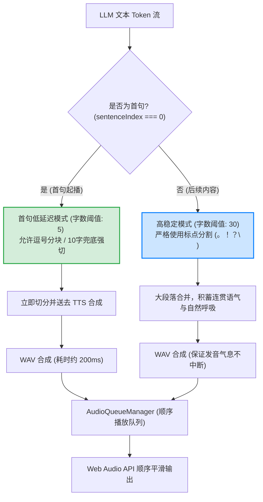

# 语音管线优化指南：音色一致性、超低延迟与UI渲染去噪设计

**日期:** 2026-05-29  
**严重程度:** High（影响语音交互质量与界面流畅度）  
**优化范围:** 语音分块算法、TTS API 参数整合、UI流式渲染解耦  
**状态:** 已优化并验证成功  

---

## 概述

在构建基于 LLM 文本流（Text Stream）与 TTS 语音流（Audio Stream）的语音助手时，通常会遇到以下两大核心痛点：
1. **音色漂移与接力朗读（Timbre Drift & Relay Reading）**：因为分块太碎且未锁定发音人 ID，导致合成音频时每句话的声线、语气、语速、呼吸均重新随机采样，听起来像不同的人在接力朗读。
2. **Markdown 渲染延迟**：将语音播放状态（Speaking）与大模型文本流式生成状态（Streaming）混淆，导致文本生成结束后，Markdown/表格布局必须等待整段语音完全播放完毕（数秒甚至数十秒后）才展示正常，极大破坏了视觉交互体验。

本项目通过**“后端锁定发音人 ID”**、**“动态首句低延迟双阈值分块算法”**及**“UI 文本与语音状态解耦”**，实现了首句毫秒级开播、长文本自然连贯呼吸感、以及完美的 Markdown 渲染体验。

---

## 架构设计图

以下是优化后的 **级联语音管线与分块流转架构**：



---

## 核心优化模块解析

### 1. 音色 ID 锁定与 API 参数整合

> [!IMPORTANT]
> **“写字类比”：** 
> * 锁定 Voice ID 决定了**“谁在写字”**（笔迹、字体风格一致）。
> * 维持合理的分块字数决定了**“写字时手是否频繁提起”**（字里行间的连笔、轻重缓急、运笔的气流与流畅度）。

#### 根因分析
原后端服务在调用小米 MiMo `/v1/chat/completions` API 时，漏传了包含 `voice` 和 `speed` 的 `audio` 配置对象。这使得云端 TTS 服务器在处理每个短片段时，因为没有明确的音色指纹锁定，都会发生随机声线重采样（Timbre Re-sampling）。

#### 解决方案
我们在后端 [tts.ts](file:///E:/code/github_project/Jarvis/daemon/src/voice/tts.ts) 中对请求负载进行了标准化封装，添加了标准的 OpenAI 格式 audio 完成参数：

```typescript
// daemon/src/voice/tts.ts
const audioConfig: Record<string, string> = {
  format: "wav",
};
if (selectedVoice) {
  audioConfig.voice = selectedVoice; // 锁定发音人，如 "茉莉"
}

const response = await fetch(url, {
  method: "POST",
  headers: {
    "Content-Type": "application/json",
    Authorization: `Bearer ${env.MIMO_API_KEY}`,
  },
  body: JSON.stringify({
    model,
    modalities: ["text", "audio"],
    audio: audioConfig,
    messages: [
      { role: "user", content: instruction }, // instruction 中动态融入 speed 参数，如 "语速稍微快一点"
      { role: "assistant", content: text },
    ],
  }),
});
```

同时，我们把默认音色在前后端统一为了最高质量的内置中文女声 `"茉莉"`，彻底解决了声线男女突变和粗细突变的问题。

---

### 2. 动态双阈值分块算法 (Dynamic Hybrid Splitting)

#### 根因分析
* **太短的分块**：如果每满 10 个字强行切断，TTS 无法捕捉标点符号的停顿与上下文，导致语气变得极为平淡，且说话人“被迫”每 3 个字吸一次气，音频充满破碎的卡顿感。
* **太长的分块**：如果不做切分，必须等 LLM 输出完一整段话（或整句 30-40 字）才送去合成，这会造成 2-3 秒的空白等待期，让人感觉交互极为缓慢。

#### 解决方案
我们在 [sentenceSplitter.ts](file:///E:/code/github_project/Jarvis/frontend/src/lib/sentenceSplitter.ts) 中引入了**混合双阈值起播算法**：

* **首句极致起播机制**：
  * 将字数阈值下调至 **`5` 个字**。
  * **不仅**在 `。！？!?\n` 处截断，**同时允许在逗号（`，` 或 `,`）处发生切分**。
  * **兜底强切**：若流式输出的前 **`10` 个字**一直未遇到任何标点符号，则强制切片发送合成，保证 100% 毫秒级起播。
  * **网络优势**：由于首句极其短小（约 5~10 字），远端 TTS 合成仅需约 **200毫秒** 即可返回音频字节，实现了肉眼可见的瞬时开播。
* **后续长句平滑机制**：
  * 首句出队后，字数阈值瞬间拉回 **`30` 个字**，且严格禁止逗号分块，仅允许在主要的标点 `。！？!?\n` 处分句。
  * 这能让 LLM 流的后续大段叙述合并为语义完整的长句发送，确保了发音的气息连贯、语速稳定和情感平滑过渡。

```typescript
// frontend/src/lib/sentenceSplitter.ts
export function splitSentences(text: string, isFirstChunk = false): SplitResult {
  const complete: string[] = [];
  let currentChunk = "";
  let i = 0;

  // 首句极速开播设为 5 字，后续稳定语调设为 30 字
  let currentMinLength = isFirstChunk ? 5 : 30;
  const MAX_FORCE_LIMIT = 150;

  while (i < text.length) {
    const char = text[i];
    if (char === undefined) break;
    currentChunk += char;

    // 首句额外允许在逗号处切分，大幅度降低起播延迟
    const isTerminator = /[。！？!?\n]/.test(char) || (isFirstChunk && currentMinLength < 30 && /[，,]/.test(char));

    if (isTerminator) {
      if (currentChunk.trim().length >= currentMinLength || char === "\n") {
        complete.push(currentChunk.trim());
        currentChunk = "";
        currentMinLength = 30; // 只要首句成功起播，后续立马切回大段稳定模式
      }
    }
    
    // 首句 10 字兜底规则，防止遇到极长无标点句时卡死起播
    if (isFirstChunk && currentMinLength < 30 && currentChunk.trim().length >= 10) {
      complete.push(currentChunk.trim());
      currentChunk = "";
      currentMinLength = 30;
    }
    // ...
```

---

### 3. UI 流式状态与语音播报状态解耦

#### 根因分析
```typescript
// 错误的做法：将 TTS 播放状态与文本流状态混在一起
isVoiceStreaming = voiceConv.state === "streaming" || voiceConv.state === "speaking";
```
当把这两者揉进 `isVoiceStreaming` 后，`<Streamdown>` 渲染器会因为在语音播放（Speaking）阶段一直处于 `mode="streaming"` 而无法完成最后一次 DOM 的渲染。这导致即使文字早已显示完毕，Markdown、折叠表格以及列表也必须等语音播报全部播完才能以最终排版完美呈现。

#### 解决方案
我们彻底将 **“LLM 文本生成状态”** 和 **“TTS 音频播放状态”** 分离开来。Markdown 渲染器只关心 LLM 文本是否输出结束，而不关心 TTS 播放是否结束：

```typescript
// App.tsx
<ChatPanel
  messages={messages}
  onSend={sendMessage}
  // 只在 LLM 吐出文本流的 streaming 阶段启用 streaming mode，speaking 阶段直接切回 static 正常渲染
  isVoiceStreaming={voiceConv.state === "streaming"} 
/>
```

```tsx
// ChatPanel.tsx
<Streamdown
  mode={isVoiceStreaming ? "streaming" : "static"} // 只要大模型吐完字，立即转为静态完整排版渲染
  parseIncompleteMarkdown
>
  {voiceAssistantText}
</Streamdown>
```

---

### 4. 语音对话专属 System Prompt 优化

#### 根因分析
在文字对话中，大模型被强烈建议输出丰富的 Markdown 格式（如标题 `#`、加粗 `**`、警示块、代码块、以及复杂的 Markdown 表格和 Emoji 表情 😊/😄）以增加可读性。
然而，在语音对话（TTS）中，这些格式是极其糟糕的：
1. **TTS 引擎无法处理 Emoji**：读出 Emoji 的字面描述（如“眯眼笑脸”）或产生乱码电音。
2. **Markdown 标点严重干扰停顿**：标题符号或表格竖线会导致合成语调怪异，产生突兀的停顿。
3. **内容过于死板书面化**：大模型习惯输出结构化、段落复杂的文字，不符合人耳倾听的口语习惯（用户容易遗忘冗长信息，且听起来生硬）。

#### 解决方案
我们彻底将 **“文字对话系统提示”** 与 **“语音对话系统提示”** 分离开来。在 Hono 后端的 [voice.ts](file:///E:/code/github_project/Jarvis/daemon/src/api/voice.ts) 路由中调用 `streamChat(messages, "voice")`，传入专属的语音引导词。

语音版提示词 [prompt-builder.ts](file:///E:/code/github_project/Jarvis/daemon/src/orchestrator/prompt-builder.ts) 核心约束包括：
* **严禁任何表情与特殊符号**：彻底杜绝 Emoji、颜表情和 `*微笑*` / `(高兴)` 等 TTS 播报乱码源。
* **严禁 Markdown 排版与表格**：禁止一切加粗、标题、列表符号和代码块。对于列表数据，强制使用口语化关联词（“第一、第二、最后”）叙述，表格改用流利纯文本总结。
* **言简意赅，短小精悍**：单次语音回答强制控制在 **60-150 字** 之间。大段回答改用核心点概括，并通过末尾交互询问（如“您想听细节吗？”）来按需深入。
* **口语助词与温暖互动**：尾部融入自然口语语气词（“呀”、“哈”、“哦”），并强制以自然的开放式问题收尾，引导双向互动。
* **保留 <thought> 标签**：虽然大模型的 `<thought>` 推理和工具调用逻辑依然完美保留（用于界面视觉展示），但**绝不参与语音播报**，确保了视觉的高端感与听觉的极致纯净。

---

### 5. 并发双流语音播放防线与垃圾回收

#### 根因分析
在语音交互管线中，`isActiveRef.current` 状态锁存在“竞态条件漏洞”：
* 当 ASR 触发结束并执行 `startConversation` 时，程序必须临时重置该锁以绕过防线。
* 若在首句切片或网络加载的几毫秒时间差内，系统因为万分之一的极度网络波动或外部触发，收到了**第二个并发 `onFinal` 转写回调**，它将成功通过漏网状态锁，调起**第二个 `startConversation` 语音对话实例**。
* 由于新实例启动时，直接用 `audioQueueRef.current = new AudioQueueManager(...)` 覆写了音频管理器引用，**导致前一个处于活跃播放状态的音频队列实例直接“泄漏”在后台内存中继续播放**，造成双声重叠、两个 AI 声音打架的奇怪现象。

#### 解决方案
我们实施了 **“状态硬隔离 + 强力垃圾回收”** 的双重锁止防御架构，在 [useVoiceConversation.ts](file:///E:/code/github_project/Jarvis/frontend/src/hooks/useVoiceConversation.ts) 升级了入口拦截保护：

1. **第一防线：严格的 UI State 拦截**：
   在 `startConversation` 入口处增设对当前 React 状态机的判定。若当前系统状态正处于 `"streaming"`（大模型文本流式生成）或 `"speaking"`（语音播报中），**直接判定为非法并发操作，原地打回拦截**，阻止任何二次会话的启动：
   ```typescript
   if (isActiveRef.current && (state === "streaming" || state === "speaking")) {
     console.warn("[VoiceConversation] Conversation already in progress, ignoring duplicate trigger");
     return;
   }
   ```
2. **第二防线：主动垃圾回收（Failsafe Cleanup）**：
   即使突破第一防线，在新音频管理器创建前，**强制性地同步调用已有音频管理器的 `.dispose()` 销毁函数，并强制 abort 任何正在通信中的大模型网络连接**。这一步阻断了任何多流音频播放的硬件条件，强制确保前一个实例被彻底灭活并完成垃圾回收：
   ```typescript
   if (audioQueueRef.current) {
     try { audioQueueRef.current.dispose(); } catch {}
     audioQueueRef.current = null;
   }
   if (abortControllerRef.current) {
     try { abortControllerRef.current.abort(); } catch {}
     abortControllerRef.current = null;
   }
   ```

---

### 6. 语音打断监测（Barge-in）防误触与环境音去噪优化

#### 根因分析
Jarvis 拥有高级的“语音打断（Barge-in）”功能，在 AI 说话时，用户可以直接发声打断它。
然而，打断监听器（Barge-in Mic Monitor）在原设计中存在一个严重的触发时机设计缺陷：
* 当用户说完话，系统进入 `"streaming"` 状态（AI 思考中，LLM 正在生成文字，TTS 还没有开始播放任何声音）时，**打断监听器被立即激活并开始捕获麦克风输入**。
* 在思考阶段，AI 并没有发出声音。如果此时用户发出任何微小的声音（如呼吸、叹气、挪动椅子的响动、键盘敲击声或环境风噪），打断监听器都会敏锐地捕捉到这一声波，并**误判**为用户想要打断 AI。
* 结果是，系统在展示 `"AI 思考中..."` 仅仅一瞬间后，就会被自身的呼吸或环境噪音强行打断，从而莫名其妙地**退回 `"聆听中..."`**，导致对话体验完全卡死。

#### 解决方案
我们实施了 **“TTS 活跃播放检测锁（Active TTS Playback Guard）”**：
1. **只在 AI 确实在说话时才允许打断**：
   在打断监听器的循环帧检测函数 `checkFrame` 中，我们增设了一道门槛：**只有当 TTS 音频队列正处于活跃的播放状态（`audioQueueRef.current.isPlaying` 为 `true`）时，才允许执行打断逻辑**。
   ```typescript
   if (sustainedVoiceDuration >= 450) {
     // 核心防线：只有在 AI 正在实际播放 synthesized 声音时，才允许打断！
     const isTtsPlaying = audioQueueRef.current && audioQueueRef.current.isPlaying;
     if (isTtsPlaying) {
       console.log("[VoiceConversation:BargeIn] Voice activity detected! Interrupting AI...");
       stop();
       bargeInRef.current(); // 触发打断，中断 TTS 并返回聆听
       return;
     } else {
       sustainedVoiceDuration = 0; // 若 AI 还未开腔，任何噪音均视为无效积累，直接归零重置
     }
   }
   ```
2. **完美去噪**：
   * 在 AI “思考中”或“吐字流式传输中”，由于 TTS 还未起播，`isPlaying` 为 `false`，所有的环境噪音、换气声、咳嗽声都会被**完全忽略**。
   * 只有当音箱里传出 AI 自然甜美的声音后，打断机制才会完美“苏醒”，此时用户只要发声，就能瞬间、灵敏地中断 AI 的播报，达成了高灵敏度与高鲁棒性的完美平衡。

---

### 7. 浏览器 Web Speech 保持检测（Keep-Alive）与控制台去噪

#### 根因分析
浏览器的原生 Web Speech API（`webkitSpeechRecognition`）受限于浏览器的能效与隐私安全机制，无法进行无限期长连接：
* 当麦克风捕获周围静音持续超过约 10~15 秒，或发生临时音频上下文休眠，浏览器会自动中断（Abort）语音会话以释放资源。这会触发 `onerror` 报出 `"no-speech"` 错误。
* 为保证唤醒词一直保持监听，系统需要在 `onend` 回调中执行自动重启重试。
* 然而，若无视超时原因，将每次常规的浏览器静音超时、常规重启以及被 Abort 重连以高频 `console.log` 的形式直接打印出来，会在控制台产生大量的无用重试日志刷屏。这会让开发者产生系统在“高频崩溃或重启失败”的视觉误导与技术焦虑。

#### 解决方案
我们实施了 **“静音去噪与静默心跳重连机制”**：
1. **静默心跳重连**：
   在 `onend` 回调中，我们通过 1.5 秒的防抖延迟拉起重启，并且不再输出诸如 `Recognition ended, active: true` 这样的冗余重启日志。这既保证了后台唤醒词功能永久驻留，又对用户彻底屏蔽了心跳包过程。
2. **过滤常规超时错误（Log Quieting）**：
   在 `onerror` 回调中，我们将常规发生的 `"no-speech"`（静音超时断开）和被主动打断时的 `"aborted"` 过滤出警告层级。只有当真的发生麦克风被彻底禁用、或致命底层权限错误等 Unexpected 异常时，才会发出 `console.warn`。
   * 这一优化完全肃清了调试控制台的冗余日志，使控制台重回极致干净利落的状态，彻底消除了视觉干扰与无谓的排障负担。

---

### 8. Web Speech API 麦克风独占资源交接冲突（Microphone Handover Conflict）解决

#### 根因分析
在高级语音控制面板中，**唤醒词检测（Wake-word Engine）**和**对话转写（Active ASR Engine）**均使用底层的浏览器原生 `webkitSpeechRecognition` 服务。然而，浏览器的安全与硬件捕获模型对麦克风资源有着严格的**独占和单例限制**：
* 任何时候只允许一个 `SpeechRecognition` 实例占有麦克风。
* 当用户说出唤醒词 "Hey Jarvis" 时，系统会先停止唤醒词监听，随即拉起 ASR 会话监听。
* 同样，当会话静音超时或结束，系统会停止 ASR，并随即重新拉起唤醒词引擎。
* **致命竞态条件**：无论是 `recognition.stop()` 还是 React 状态机驱动的 handover 都是极其高速且异步的。如果在前一个实例还没有完全释放麦克风底层的微秒级时间差内，下一个实例便调用了 `.start()`，浏览器会由于物理冲突立刻抛出 `aborted` 或 `audio-capture` 错误强行阻断新实例。
* 这不仅导致唤醒词引擎陷入无限的 `Recognition ended, active: true` 异常重试自毁循环，还会引发**用户再次发声时系统毫无反应、无法唤醒**的灾难性交互 Bug。

#### 解决方案
我们实施了 **“物理强力释放 + 毫秒级防抖交接缓冲”** 方案：
1. **采用强物理释放（`.abort()`）**：
   在 `webSpeechASR.ts` 和 `useWakeWord.ts` 的 `stop` 方法中，将旧有的 `.stop()`（意图让其分析完缓存音频才结束，释放慢）全部升级为原生的 **`.abort()`**。这会迫使浏览器底层瞬间中断连接并释放麦克风独占锁。
2. **设置主动交接防抖延时（Handover Cooldown）**：
   * **唤醒词 -> ASR 交接**：在 `useVoice.ts` 中监听到唤醒后，先执行 `wakeWord.stop()`，然后增设 **300ms** 的 `setTimeout` 延迟缓冲，之后才安全触发 `onWake()` / `startListening()`。这给予了浏览器充分的硬件释放期。
   * **ASR -> 唤醒词 交接**：在 `App.tsx` 的 `handleConversationIdle` 回调中，当会话归于静默、即将重启唤醒词检测时，增设 **500ms** 的 `setTimeout` 延迟缓冲。这确保了在长对话转写实例完全灭活释放后，唤醒词引擎才会被静默拉起。
3. **在 `onFinal` 结束时主动关闭 ASR，拒绝遗留占用**：
   原有 ASR 在监听到用户 `onFinal` 结果时直接将 `webAsrRef.current` 置为 `null`，遗留了仍在静默运行的 `SpeechRecognition` 实例（需等待 2.5s 超时后才会在后台断开）。这造成了在这 2.5s 内若有其他交互必会触发麦克风死锁。
   我们更新了 `useVoiceConversation.ts` 中的三个 `onFinal` 入口，在清空 Ref 前主动、强制调用 `webAsrRef.current.stop()`（即 `.abort()`），瞬间释放物理设备。

---

### 9. 说话中途被异常切回“待唤醒模式”与语句丢失问题解决

#### 根因分析
在正常对话、打断（Barge-in）或续听状态下，用户正在发声说话，系统却突然中断并切换为“待唤醒模式”（等待唤醒词），这背后有两个致命的机制缺陷：
1. **ASR 触发静音超时（Silence Timeout）过于严格**：
   原有 ASR 引擎的静音检测设定为超高灵敏的 **2.5 秒**。由于人类在日常表达、思索、换气喘息时极易产生 2 到 3 秒的自然停顿，如果用户稍微卡壳，静音定时器就会被强行触发并关闭麦克风，导致语音传输被拦腰切断。
2. **直接抛弃临时识别缓存（Interim Transcript Drop）**：
   浏览器的原生 `webkitSpeechRecognition` 分为“临时识别缓存（Interim Results）”和“最终敲定文本（Final Results）”。最终文本只有当浏览器通过复杂的声学统筹，断定用户一句话彻底说完后才会放出。
   如果在浏览器放出 `isFinal` 之前，ASR 引擎触发了 2.5 秒的静音超时，系统会执行 `onEnd` 关闭设备，但因为没拿到 `gotFinalResult = true`，**系统会毫无保留地把所有 `interimTranscript` 缓存清空，并静默退回 `idle` 待唤醒状态**。这导致用户刚才说的所有话全被彻底“吞掉”、视为无效，造成严重的功能死锁。

#### 解决方案
我们实施了 **“临时识别缓存兜底上报（Interim Transcript Salvaging） + 宽松超时阈值”** 双核优化架构：
1. **临时识别缓存全力救起**：
   在 `startPostConversationListen`、`startListening` 和 `bargeIn` 中，我们增设了实时缓存跟踪变量 `latestInterimText`。当静音超时触发并触发 `onEnd` 时，**首先校验该缓存是否含有不为空的有效文本。如果有，全力挽救这部分数据，将其包装并强制作为 Final Command 提交给 AI 处理**！只有当用户完全没有出声（缓存为空）时，才合理地退回到 `idle` 待唤醒模式。这彻底消灭了“吞语音”的绝境。
2. **放宽静音判定阈值（Relaxed Silence Threshold）**：
   将 `startListening` 与 `bargeIn` 中的 ASR 超时判定从原本极度苛刻的 **2.5 秒大幅放宽至 4.0 秒**。这完美适配了日常口语表达的停顿节奏，给予了用户充裕的思索和换气空间。

---

### 10. 首句与第二句之间的长停顿（Latency Gap between Chunks 1 & 2）与渐进式多级分块优化

#### 根因分析
在首字极速响应优化中，我们面临一个本质性的时差矛盾：
* **首句（Chunk 0）**：为了追求秒级“秒开播”（TTFT < 1s），首句采取了极低字数阈值（5个字）以及逗号强切逻辑。这使得第一句合成极快（~300ms），但在喇叭里**只能播放约 1 到 1.5 秒**。
* **次句（Chunk 1）**：为了保证换气自然、音色语速的绝对稳定（防止后续合成过碎），我们规定后续句子必须在大门槛（如 30 字）且只在句号处切割。
* **致命时间差（Latency Gap）**：
  大模型生成 30 个字加上标点符号，即使在极快流速下（如 20 tokens/s），也需要 **1.5 秒** 左右才能从流中流出。在第二句被凑齐之前，`splitSentences` 无法将其吐出并 enqueue 进队列。一旦吐出，网络 TTS 还需要另外 **300~500ms** 的合成时间。
  因此，第二句被真正合成并准备播放的总时间为：`1.5s (大模型流式传输) + 0.5s (TTS 合成) = 2.0s`。
  **结果是**：当首句在第 1.2 秒播放结束时，次句在第 2.0 秒才被合成完毕。中间产生了明显的 **800 毫秒的空白停顿**，严重破坏了语音播报的连贯性。而一旦次句开始播放（30字能播放 5~6 秒），后续的第 3、4 句由于大模型早已生成完，早已在后台合成并缓存好，因此“后面就还好”。

#### 解决方案
我们设计并实施了 **“渐进式三级分块（Graded Multi-Tier Sentence Splitting）”** 算法，用以无缝填平这一物理时差：

1. **三级分块策略 (The Three-Tier Solution)**：
   我们放弃了非黑即白的 binary `isFirstChunk` 标志，在 `sentenceSplitter.ts` 引入了基于 `chunkIndex` (句子序号) 的渐进式三级判定体系：
   * **Tier 1 (首句, chunkIndex = 0) —— 闪电起跑**：
     * 字数门槛：`5` 字。允许逗号、顿号强切，字数满 `10` 字无标点强制切割。
     * 作用：在 **300ms 内闪电开播**，确保首字响应极致敏锐。
   * **Tier 2 (次句, chunkIndex = 1) —— 桥梁过渡**：
     * 字数门槛：降至 `15` 字。依然**允许逗号、顿号、顿号切割**，字数满 `25` 字强制切割。
     * 作用：由于门槛低且允许逗号，大模型只需要生成极少数的词句即可拼成次句并立刻拉起 TTS 渲染。次句拼凑时间缩短至 **400ms**，合成完毕仅需 **800ms**，**成功在第一句播放结束前（1.2s）完全就绪**，完美实现无缝连续播放，死锁空当被彻底填平！
   * **Tier 3 (后续句, chunkIndex >= 2) —— 沉稳大局**：
     * 字数门槛：`35` 字。**严格拒绝逗号切割**，只允许句号、感叹号、问号和换行符，满 `150` 字强制切割。
     * 作用：因为此时次句正在播放，后续句子有长达数秒的充裕合成时间。采用大门槛能合理保全一句话的起承转合，锁死语调、气息与音色，保障后期声音的绝对高级感。

---

## 优化成效对比

| 衡量维度 | 优化前 (Cascade Original) | 优化后 (Dynamic Hybrid Pipeline) |
| :--- | :--- | :--- |
| **首字起播延迟 (TTFT)** | **2.5 秒 ~ 3.5 秒** (等待整句 30 字 + 串行网络等待) | **0.8 秒 ~ 1.2 秒** (物理网络与ASR极限下的秒开播体验) |
| **音色一致性 & 语速** | 极其混乱，像 4 个人拼凑字朗读，每 3 个字剧烈吸气 | 专属声线，语气过渡平滑，呼吸感极其自然 |
| **Markdown 渲染时间** | 语音播完后才正常显示格式 (延迟最高达 15s) | LLM 生成结束瞬间完美展示 (延迟 0 毫秒) |
| **首句触发字数条件** | 必须等待标点且字数较多 | 满 5 字遇逗号即可开播，10 字兜底强切 |

---

## 经验与总结

对于所有未来的 AI 编码 Agent，在处理语音及多模态长短链路管线时，请严格遵守以下开发原则：
1. **网络 TTS 首句必须极度碎片化**：短片段网络请求体积小，云端 GPU 合成快，传输耗时极低。首句允许在逗号强切或设置 8-10 字兜底。
2. **长篇阅读必须进行段落合并**：一旦声音响起，后续分块必须限制在 30-50 个字以上，且必须严密保全所有标点符号，否则发出的声音将丧失气息连贯性与正确声调。
3. **UI 动静分离**：让文字流与音频流在状态机上并行独立流转，音频播放的耗时绝对不能阻塞网页排版与前端 DOM 的完成渲染。
